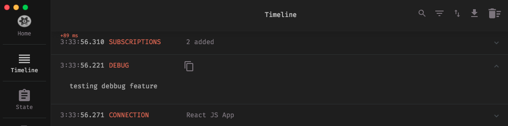
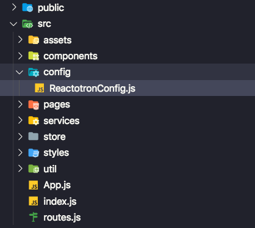
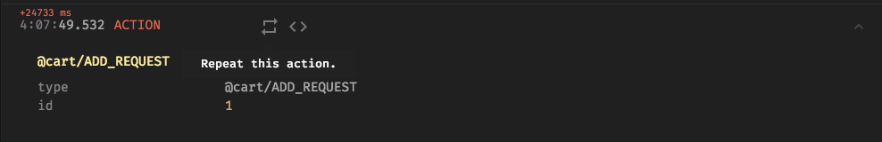
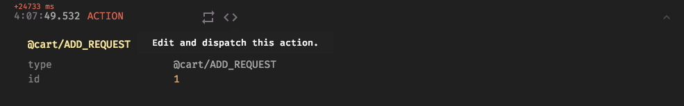
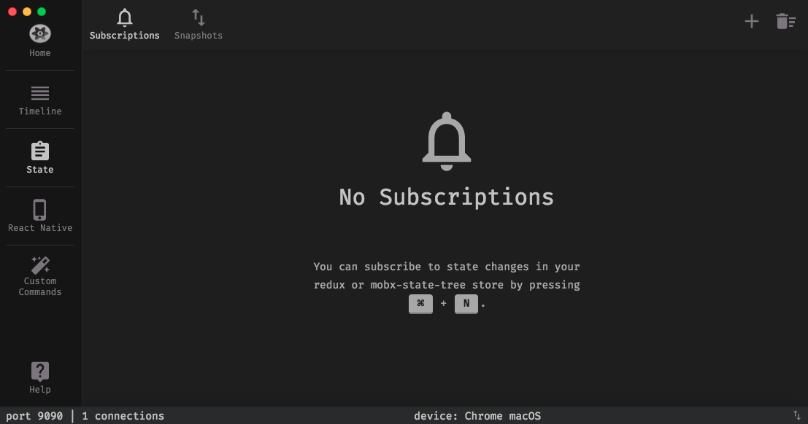
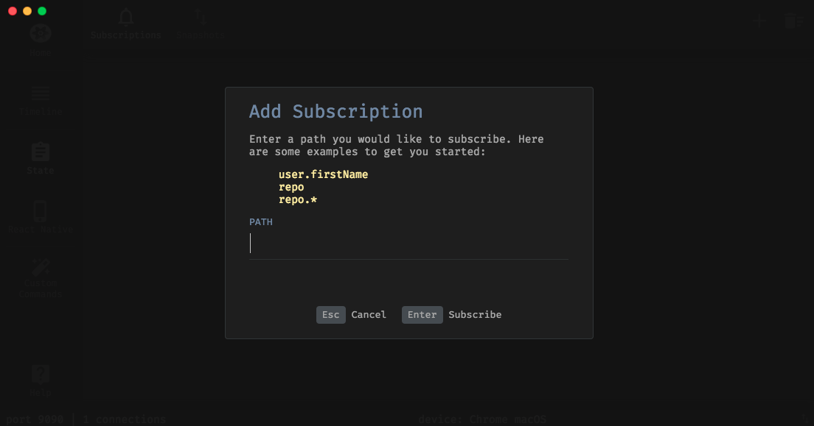
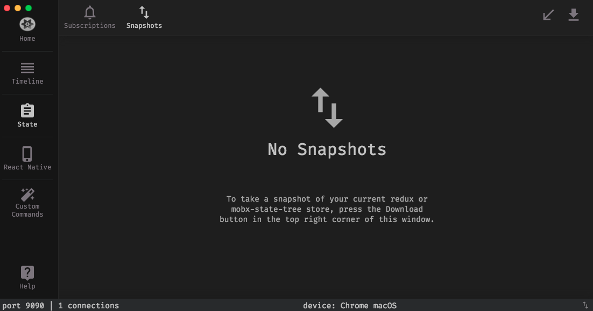

# About **reactotron**.

- Documentation can be found at: https://github.com/infinitered/reactotron
- It can be downloaded at: https://github.com/infinitered/reactotron/releases
- Available to:
macOS
Linux (32-bit & 64-bit)
Windows (32-bit & 64-bit)

**What does this tool have to offer?**

- view your application state
- show API requests & responses
- perform quick performance benchmarks
- subscribe to parts of your application state
- display messages similar to console.log
- track global errors with source-mapped stack traces including saga stack traces!
- dispatch actions like a government-run mind control experiment
- hot swap your app's state using Redux or mobx-state-tree
- track your sagas
- show image overlay in React Native
- track your Async Storage in React Native

### PS:
- You plug it into your app as a dev dependency so it adds nothing to your product builds.
- `console.tron.log` Shows something like the traditional **console.log** in the reactotron interface as a **debug** field.



# To run JSON server api:

**Run:**
```
yarn global add json-server
or
npm install -g json-server
then
json-server server.json -p 3333 -w
```

# To run the project:

**Run:**
```
yarn (to install dependencies)
and then
yarn start (to run the project)

PS: you can use npm too if you want.
To ensure the connection to reactotron the ideal is to open reactotron and then run the application
```

# Setup:

**Run:**
```
yarn add reactotron-react-js reactotron-redux
```

**You can create a config directory with a Reactotronconfig.js file inside. (as we have in this example)**



**The settings looks like this:**

```js
import Reactotron from 'reactotron-react-js';
import { reactotronRedux } from 'reactotron-redux';
import reactotronSaga from 'reactotron-redux-saga';

if (process.env.NODE_ENV === 'development') {
  const tron = Reactotron.configure()
    .use(reactotronRedux())
    .use(reactotronSaga())
    .connect();

  tron.clear();

  console.tron = tron;
}
```
**Import ReactotronConfig** on **~/App.js**

```js
import './config/ReactotronConfig';
```

**Integration with redux store and saga**

```js
import { createStore, applyMiddleware, compose } from 'redux';
import createSagaMiddleware from 'redux-saga';

import rootReducer from './modules/rootReducer';
import rootSaga from './modules/rootSaga';

const sagaMonitor =
  process.env.NODE_ENV === 'development'
    ? console.tron.createSagaMonitor()
    : null;

const sagaMiddleware = createSagaMiddleware({
  sagaMonitor,
});

const enhancer =
  process.env.NODE_ENV === 'development'
    ? compose(
        console.tron.createEnhancer(),
        applyMiddleware(sagaMiddleware)
      )
    : applyMiddleware(sagaMiddleware);

const store = createStore(rootReducer, enhancer);

sagaMiddleware.run(rootSaga);

export default store;
```

# Some cool features:
You can repeat a **action**:



You can **edit** and **dispatch** again:



You can do **subscriptions** to monitor specific changes:



Add a **subscription**:



PS: these subscriptions accept dot notation and so on.

You can work with **snapshots** to restore state:


